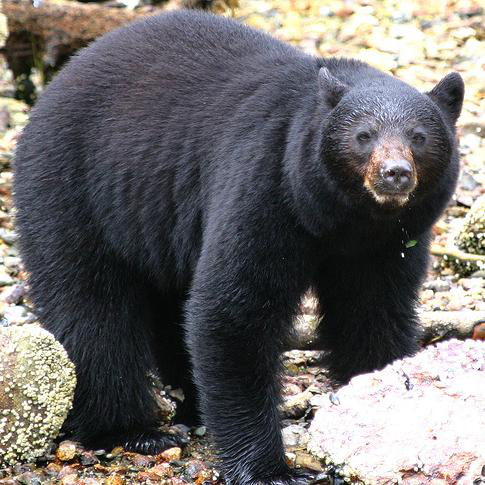
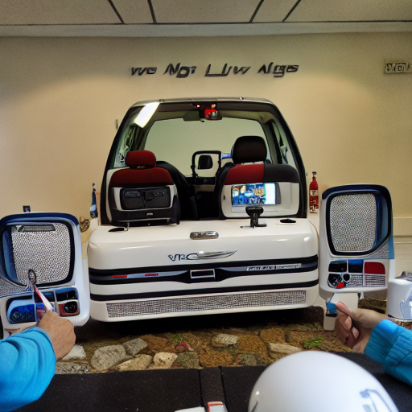
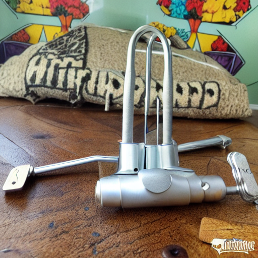

# Decoding visual stimulus from non-invasive MEG recordings of brain activity

This repository is an implementation for the paper:  
**[Decoding visual stimulus from non-invasive MEG recordings of brain activity](https://arxiv.org/abs/2310.19812)** 

[Watch the detailed video explanation and walk-through here](https://youtu.be/8kQtN1Wgr98)

## 1. Introduction

Decoding the human mind from brain activity has been a long-standing goal in neuroscience and AI. While functional Magnetic Resonance Imaging (fMRI) has yielded impressive results in reconstructing visual imagery, its low temporal resolution limits its ability to capture the rapid dynamics of human cognition. Conversely, non-invasive techniques like Magnetoencephalography (MEG) offer millisecond-level temporal precision but suffer from an inherently low spatial resolution, making the decoding of complex visual representations exceptionally challenging.

In this project, we overcome these limitations by bridging the gap between non-invasive MEG recordings and deep generative models. We present a deep learning pipeline that continuously decodes continuous brain wave signals from the **THINGS-MEG** dataset into rich, multi-modal latent spaces:
* **CLIP-Vision** (Semantic Visual features)
* **CLIP-Text** (Linguistic/Conceptual features)
* **AutoKL** (Spatial perceptual layouts)

These latents are then fed into strong generative foundations, such as **Versatile Diffusion**, to directly reconstruct what the human subjects were seeing in real-time. This codebase provides the end-to-end framework starting from BIDS-compliant MEG preprocessing, building highly-optimized Spatial-Temporal `BrainModule` architectures, running contrastive/regression optimizations, all the way to Retrieval and Generation evaluations. 

---

## 2. Example Results (Image Generation & Retrieval)

### 2.1 Reconstructed Images
Below are some successful examples of Ground Truth (GT) stimulus images shown to the subjects, alongside the corresponding Generative outputs derived purely from decoding their non-invasive MEG Brain signals.

*(Note: The generated images rely on decoded brain features averaged across 12 trials, intelligently combining shapes from AutoKL and semantics from CLIP).*

| Ground Truth (Stimulus) | Decoded & Generated from MEG |
| :---------------------: | :--------------------------: |
|  |  |
|  |  |
|  |  |

### 2.2 Semantic Retrieval Performance
To quantitatively evaluate how well the decoded signals capture the semantics and structures of the seen objects, we conduct **Top-5 Retrieval Classification** tasks. We measure this under two stringencies:
* **Small-Set Retrieval (200-way)**: Classifying the MEG predictions against a pool of 200 distinct visual categories. Here, we average the MEG predictions of 12 identical-category trials to amplify the signal-to-noise ratio.
* **Large-Set Retrieval (2400-way)**: A much harder, single-trial classification. We attempt to retrieve the exact image out of a pool of 2,400 distinct images, using only a single 1-second MEG trial. 

| Feature Space | Small-Set Top-5 Acc. (200-way) | Large-Set Top-5 Acc. (2400-way) |
| :--- | :---: | :---: |
| **CLIP Vision** (Visual Semantics) | **46.75%** | **4.52%** |
| **CLIP Text** (Conceptual Semantics) | **20.75%** | **1.38%** |
| **AutoKL** (Spatial Topology) | **6.62%**  | **0.56%** |

*Note: Random chance for Small-Set Top-5 is 2.5%, and for Large-Set Top-5 is 0.20%. Across all 4 participants, our `BrainModule` significantly outperforms random chance, proving that visual semantics can be faithfully identified from MEG dynamics.*

---

## 3. Step-by-step Execution Guide 🚀

Follow this guide to get the project working locally from scratch.

### 3.1. Environment Setup
First, replicate the exact Python environment used for this project leveraging our `environment.yml` configuration.
```bash
conda env create -f environment.yml
conda activate MEGBrainDecoding
```

### 3.2. Download Versatile Diffusion and Models
Just like [brain-diffuser](https://github.com/ozcelikfu/brain-diffuser), you must set up the **Versatile Diffusion** subsystem. We assume the `versatile_diffusion` codebase is inside the root directory.

```bash
# Download the pretrained weights for VD into the existing pretrained directory:
wget -O versatile_diffusion/pretrained/vd-four-flow-v1-0-fp16-deprecated.pth "https://huggingface.co/shi-labs/versatile-diffusion/resolve/main/pretrained_pth/vd-four-flow-v1-0-fp16-deprecated.pth"
```

### 3.3. Download the Datasets
1. **THINGS Image Database**: Download the stimulus images from [https://things-initiative.org/projects/things-images/](https://things-initiative.org/projects/things-images/).
2. **THINGS-MEG Data**: Please follow the instructions provided by the [ViCCo-Group/THINGS-data repository](https://github.com/ViCCo-Group/THINGS-data) to download the raw BIDS MEG data from OpenNeuro (`ds004212`).

### 3.4. Update Global Configuration
Open `config.py` in the root folder and point the directories to where your data was downloaded:
```python
# config.py
MEG_RAW_DIR = "/path/to/your/THINGS-data/THINGS-MEG/" # Original ds004212 location
MEG_PREPROCESSED_DIR = "/path/to/save/derivatives/preprocessed/" # Where filtered epochs will be saved
```

### 3.5. Preprocessing of MEG Data
We use MNE-Python to run noise filtering, baseline correction, robust scaling minus extreme artifacts, and resampling. You need to run this for all participants (`P1`, `P2`, `P3`, `P4`).

Before running the preprocessing steps, you must set up a dedicated environment for MNE and the MEG processing libraries:
```bash
conda env create -f THINGSdata_preprocessing/THINGS-data/MEG/environment_THINGS-MEG.yml
conda activate THINGS-MEG
```

```bash
# 1. Run BIDS Preprocessing (MNE Epoching, Filtering, Artifact Removal)
python THINGSdata_preprocessing/THINGS-data/MEG/step1_preprocessing_edited.py -participant 1
python THINGSdata_preprocessing/THINGS-data/MEG/step1_preprocessing_edited.py -participant 2
python THINGSdata_preprocessing/THINGS-data/MEG/step1_preprocessing_edited.py -participant 3
python THINGSdata_preprocessing/THINGS-data/MEG/step1_preprocessing_edited.py -participant 4

# 2. Organize and format epochs into .h5 structure (with Dataset splitting)
python data/prepare_data_fromfif.py

# 3. Extract correct 2D Sensor layouts (used in the Spatial Attention block)
python script/extract_sensor_postions.py
```

### 3.6. Ground Truth Target Extraction
Before training the brain decoders, we need to extract the exact latent representations of the images using the Versatile Diffusion vision and text models.
```bash
python script/extractfeatures2latentspace_clipvision.py
python script/extractfeatures2latentspace_cliptext.py
python script/extractfeatures2latentspace_AutoKL.py

# Create paired datasets specifically for Top-5 Retrieval evaluation
python script/retrieval_utils.py
```

### 3.7. Train the `BrainModule` Decoders
Train the isolated translation models mapping the MEG timeseries blocks to respective latent dimensions. 
> 🧠 **Important Deviation from the Original Setup:** Unlike the original methodology that regresses onto the raw latent vectors, **we independently Z-score (normalize) the target latent dimensions during training**. Our MSE heads are optimized to predict the normalized spatial embeddings, successfully repairing signal variance collapse often seen in generative diffusion mappings!

*(Each script will automatically save checkpoints and statistics into `./checkpoints/`)*.
```bash
python script/train_brainmodule_clipvision.py
python script/train_brainmodule_cliptext.py
python script/train_brainmodule_AutoKL.py
```

### 3.8. Retrieval Task (Evaluation)
Test your trained models against standard metrics. Specifically, we test Concept Retrieval Accuracy based on Cosine Similarity vectors to classify and retrieve corresponding semantics against banks of image embeddings.
```bash
# Concept Retrieval Accuracy on small & large test sets
python script/retrieval_smallset.py
python script/retrieval_largeset.py
```

### 3.9. Generation Task
Using the Test Set MEG trials, push the signals through the trained decoders, apply target denormalization (restoring original data variance dynamically), and reconstruct the image using the Versatile Diffusion sampler.
```bash
python script/generate_images_VersatileDiffusion_refactored.py --subject P1
python script/generate_images_VersatileDiffusion_refactored.py --subject P2
python script/generate_images_VersatileDiffusion_refactored.py --subject P3
python script/generate_images_VersatileDiffusion_refactored.py --subject P4
```
*(Images will be output to `./results/image_generation/`)*


---

## 4. References 📚
1. **Visual Image Reconstruction from Human Brain Activity**: Decoding visual stimulus from non-invasive MEG recordings of brain activity [(ArXiv)](https://arxiv.org/abs/2310.19812)
2. **Decoding Speech from MEG**: Decoding speech from non-invasive brain recordings [(Defossez et al., Nature Machine Intelligence)](https://arxiv.org/abs/2208.12266)
3. **Brain-Diffuser**: Natural Image Reconstruction From fMRI Signals via continuous Diffusion processes. [(Ozcelik & Van Rullen) Github](https://github.com/ozcelikfu/brain-diffuser)
4. **Versatile Diffusion**: Text, Images, and Variations All in One Diffusion Model [(Xu et al.) Github](https://github.com/SHI-Labs/Versatile-Diffusion)
5. **THINGS-data Database**: A large-scale multivariate dataset of MEG and fMRI signals. [(Hebart et al.)](https://github.com/ViCCo-Group/THINGS-data)
6. **THINGS-Image Initiative**: Object image concept dataset [(THINGS)](https://things-initiative.org/projects/things-images/)
